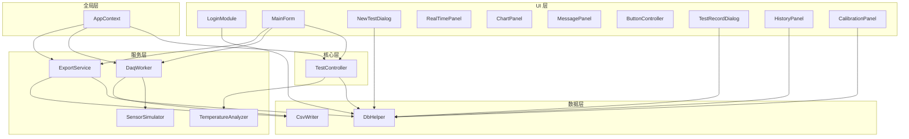

# 概览设计

## Simulation System for Non-combustibility Test of Building Materials
### 建筑材料不燃性试验仿真系统

---

| 文档信息 | |
|----------|------|
| 项目名称 | NCT-Sim：建筑材料不燃性试验仿真系统 |
| 版本 | v1.0 |
| 作者 | ximu-dot |
| 日期 | 2026-06-14 |

---

## 目录

1. [系统架构概览](#1-系统架构概览)
2. [模块划分与职责](#2-模块划分与职责)
3. [架构图](#3-架构图)
4. [接口定义](#4-接口定义)
5. [数据流设计](#5-数据流设计)
6. [功能模块优先级分级](#6-功能模块优先级分级)
7. [非功能需求设计](#7-非功能需求设计)
8. [风险评估](#8-风险评估)
9. [用户参与度](#9-用户参与度)
10. [技术选型总结](#10-技术选型总结)

---

## 1. 系统架构概览

### 1.1 架构模式

采用 **分层架构 (Layered Architecture)** + **事件驱动 (Event-Driven)** 模式：

```
┌─────────────────────────────────────────────┐
│                UI 层 (Forms)                  │
│  LoginForm  MainForm  NewTestForm  ...       │
├─────────────────────────────────────────────┤
│            业务核心层 (Core)                  │
│  TestController (状态机 + 业务逻辑)           │
├─────────────────────────────────────────────┤
│              服务层 (Services)                │
│  DaqWorker  SensorSimulator  ExportService   │
├─────────────────────────────────────────────┤
│              数据层 (Data)                    │
│  DbHelper  CsvWriter                         │
├─────────────────────────────────────────────┤
│              全局层 (Global)                  │
│  AppContext (单例，持有所有核心对象)           │
└─────────────────────────────────────────────┘
```

### 1.2 设计原则

| 原则 | 说明 | 实现方式 |
|------|------|---------|
| 单向依赖 | 上层依赖下层，下层不知上层 | 接口抽象 + DI |
| 事件驱动 | 数据从下层传到上层用事件 | `DataBroadcast` 事件 |
| UI 线程安全 | 所有 UI 更新在 UI 线程 | `Control.Invoke()` |
| 配置驱动 | 行为参数由配置文件控制 | `appsettings.json` |
| 仿真/硬件双模式 | 同一接口，两种实现 | `EnableSimulation` 配置切换 |

---

## 2. 模块划分与职责

### 2.1 模块清单

| 模块ID | 模块名称 | 所属层 | 职责 |
|:---:|---------|:---:|------|
| M01 | LoginModule | UI | 角色选择、密码验证、登录控制 |
| M02 | MainForm | UI | 主窗口容器，Tab 管理，全局事件分发 |
| M03 | NewTestDialog | UI | 新建试验信息录入表单 |
| M04 | RealTimePanel | UI | 5通道温度显示、计时器、状态指示 |
| M05 | ChartPanel | UI | OxyPlot 温度曲线图（4条折线） |
| M06 | MessagePanel | UI | 系统消息日志显示 |
| M07 | ButtonController | UI | 按钮状态管理（根据状态机启用/禁用） |
| M08 | TestRecordDialog | UI | 试验现象记录（火焰、质量）表单 |
| M09 | HistoryPanel | UI | 历史记录查询界面 |
| M10 | CalibrationPanel | UI | 设备校准界面 |
| M11 | TestController | Core | 状态机管理、业务逻辑协调 |
| M12 | DaqWorker | Service | 数据采集线程（每800ms），分发数据 |
| M13 | SensorSimulator | Service | 仿真温度引擎（5通道算法） |
| M14 | ExportService | Service | CSV/Excel/PDF 报告生成 |
| M15 | TemperatureAnalyzer | Service | 温漂计算（线性回归）、终止条件判断 |
| M16 | DbHelper | Data | SQLite 数据库操作封装 |
| M17 | CsvWriter | Data | 温度时序数据 CSV 写入 |
| M18 | AppContext | Global | 全局单例，持有配置和核心对象引用 |

### 2.2 模块依赖关系



---

## 3. 架构图

### 3.1 系统部署架构

```
┌──────────────────────────────────────────────────┐
│              Windows 10/11 桌面环境                │
│                                                   │
│  ┌─────────────────────────────────────────┐     │
│  │         NCT-Sim.exe (.NET 8)             │     │
│  │  ┌───────┐ ┌──────┐ ┌──────────────┐   │     │
│  │  │ WinForms│ │OxyPlot│ │EPPlus/PDFsharp│  │     │
│  │  └───────┘ └──────┘ └──────────────┘   │     │
│  └─────────────────────────────────────────┘     │
│         │              │              │           │
│         ▼              ▼              ▼           │
│  ┌──────────┐  ┌────────────┐  ┌──────────┐     │
│  │ SQLite DB │  │ CSV Files   │  │ Reports  │     │
│  │ISO11820.db│  │/TestData/   │  │/Reports/ │     │
│  └──────────┘  └────────────┘  └──────────┘     │
└──────────────────────────────────────────────────┘
```

### 3.2 运行时进程模型

```
主线程 (UI Thread)
  ├── MainForm (消息循环)
  │   ├── Tab: 试验控制
  │   ├── Tab: 记录查询
  │   └── Tab: 设备校准
  │
  └── DaqWorker 后台线程
      ├── 每 800ms 触发一次
      ├── 调用 SensorSimulator.Update()
      ├── 更新温度数据
      ├── 检查状态转换条件
      ├── 触发 DataBroadcast 事件 → UI 线程 Invoke
      └── 写入 CSV 数据（Recording 状态）
```

---

## 4. 接口定义

### 4.1 数据库接口 (DbHelper)

```csharp
public class DbHelper
{
    // 用户认证
    bool Login(string username, string pwd, out string userid, out string usertype);

    // 试验 CRUD
    void InsertTest(string productId, string testId, ...);
    void UpdateTestResult(string productId, string testId, ...);
    List<TestRecord> QueryTests(DateTime from, DateTime to, string productId);

    // 设备管理
    Apparatus GetApparatus(int apparatusId);
    void UpdateConstPower(int apparatusId, int constPower);

    // 传感器
    List<Sensor> GetAllSensors();
    void UpdateSensorValue(int sensorId, double value);

    // 校准
    void InsertCalibration(CalibrationRecord record);
    List<CalibrationRecord> QueryCalibrations(DateTime from, DateTime to);
}
```

### 4.2 仿真引擎接口 (SensorSimulator)

```csharp
public class SensorSimulator
{
    // 核心更新（每 800ms 调用一次）
    void Update(TestState state, double targetTemp, double heatingRate, double fluctuation);

    // 温度值获取
    double GetTemp(int channel);  // 0=TF1, 1=TF2, 2=TS, 3=TC, 4=TCal

    // 状态查询
    bool IsStable { get; }
    int StableTickCount { get; }

    // 控制
    void StartCooling();
    void Reset();
}
```

### 4.3 状态机接口 (TestController)

```csharp
public class TestController
{
    // 状态
    TestState CurrentState { get; }  // Idle, Preparing, Ready, Recording, Complete

    // 操作
    void StartHeating();
    void StopHeating();
    void StartRecording();
    void StopRecording();
    void SaveTestRecord(TestRecordData data);
    void NewTest(NewTestData data);
}
```

### 4.4 数据广播事件

```csharp
public class DataBroadcastEventArgs : EventArgs
{
    public double[] Temperatures { get; set; }     // 5 通道温度
    public int ElapsedSeconds { get; set; }        // 记录计时
    public double TemperatureDrift { get; set; }   // 温漂
    public TestState CurrentState { get; set; }    // 当前状态
    public List<MasterMessage> Messages { get; set; } // 系统消息
}

public class MasterMessage
{
    public string Time { get; set; }    // HH:mm:ss
    public string Message { get; set; } // 消息内容
}
```

---

## 5. 数据流设计

### 5.1 温度数据流

```
SensorSimulator (仿真算法)
    │
    │  每 800ms
    ▼
DaqWorker (数据采集线程)
    │
    ├──→ 更新 sensors 表 outputvalue
    │
    ├──→ [Recording 状态] CsvWriter 写入 sensor_data.csv
    │
    └──→ 触发 DataBroadcast 事件
            │
            ▼ (通过 Invoke 封送)
        MainForm UI 更新
            ├──→ RealTimePanel (温度数值)
            ├──→ ChartPanel (曲线图更新)
            └──→ MessagePanel (系统消息)
```

### 5.2 试验数据流

```
用户操作
    │
    ├── 新建试验 → DbHelper.InsertTest() → testmaster 表
    │
    ├── 开始升温 → TestController.StartHeating()
    │              → 状态: Preparing
    │
    ├── 温度稳定 → TestController 自动检测
    │              → 状态: Ready
    │
    ├── 开始记录 → TestController.StartRecording()
    │              → 状态: Recording
    │              → CsvWriter 开始写入
    │
    ├── 停止记录 → TestController.StopRecording()
    │              → 状态: Complete
    │
    └── 保存记录 → TestController.SaveTestRecord()
                   → DbHelper.UpdateTestResult()
                   → ExportService.GenerateExcel()
                   → ExportService.GeneratePdf()
```

### 5.3 报告生成数据流

```
DbHelper.QueryTest() → 试验信息
    │
CsvWriter.ReadData() → 温度时序数据
    │
    ├──→ ExportService.GenerateExcel()
    │     ├── Sheet1: 试验信息表
    │     ├── Sheet2: 温度数据表
    │     └── Sheet3: 温度曲线图 (OxyPlot 导出为图片)
    │
    └──→ ExportService.GeneratePdf()
          ├── 试验概要
          ├── 温度曲线图片
          └── 判定结论
```

---

## 6. 功能模块优先级分级

| 优先级 | 模块 | 理由 |
|:---:|------|------|
| **P0** | 登录、新建试验、温度仿真、状态机、实时显示、曲线图、按钮控制、试验记录、CSV导出 | 核心流程，缺一不可 |
| **P1** | 系统消息、Excel/PDF报告、历史查询 | 提升完整性，评分加分项 |
| **P2** | 设备校准、参数配置 | 锦上添花，时间允许则做 |
| **P3** | 多语言、数据备份 | 本次不实现 |

**高内聚低耦合设计**：
- P0 模块高度内聚在 TestController 周围
- P1 模块通过独立 Service 实现，不污染核心逻辑
- 各模块间通过事件和接口通信，耦合度低
- 需求变更时影响范围可控（修改单个 Service 不影响其他模块）

---

## 7. 非功能需求设计

### 7.1 性能设计

| 策略 | 实现 |
|------|------|
| 后台线程采集 | DaqWorker 独立线程，不阻塞 UI |
| 增量曲线更新 | OxyPlot `InvalidatePlot(true)` 仅更新变化点 |
| 滚动窗口 | 曲线图仅保留最近 10 分钟数据（750 个点） |
| 批量数据库写入 | 累积多条记录后批量 INSERT |
| CSV 流式写入 | 使用 `StreamWriter` 追加模式，不加载全文件 |

### 7.2 可靠性设计

| 策略 | 实现 |
|------|------|
| 数据库连接池 | `using` 语句确保连接及时释放 |
| 文件写入容错 | try-catch + 重试 + 用户提示 |
| 配置缺失默认值 | `appsettings.json` 缺失时使用硬编码默认值 |
| 状态机防错 | 非法状态转换直接忽略 + 日志警告 |
| 日志记录 | Serilog 分级日志（Debug/Info/Warning/Error） |

### 7.3 安全性设计

| 策略 | 实现 |
|------|------|
| 角色权限 | admin 可配参数，operator 仅操作试验 |
| 按钮保护 | 根据状态机禁用不可用操作按钮 |
| 数据保护 | 未保存的试验数据阻止新建试验 |

---

## 8. 风险评估

### 8.1 技术风险矩阵

| 风险ID | 风险描述 | 概率 | 影响 | 风险值 | 应对措施 |
|:---:|---------|:---:|:---:|:---:|---------|
| R01 | 温度仿真数据不真实 | 30% | 中 | 中 | 参考真实物理模型调参，加入合理随机噪声 |
| R02 | 实时曲线渲染卡顿 | 15% | 高 | 中 | 滚动窗口 + 增量更新，预验证性能 |
| R03 | 跨线程 UI 崩溃 | 25% | 高 | 高 | 强制 Invoke 封装，代码审查检查点 |
| R04 | Excel 图表生成兼容性 | 20% | 中 | 中 | 测试多种 Excel 版本，备选方案 CSV |
| R05 | PDF 中文乱码 | 30% | 中 | 中 | 嵌入中文字体，预测试验证 |
| R06 | 第三方库版本冲突 | 10% | 高 | 低 | 锁定 NuGet 版本，定期检查兼容性 |

### 8.2 风险监控机制

```
开发过程:
  每日检查 → Git 提交 + 功能测试 → 问题及时修复

集成阶段:
  全流程跑通测试 → 记录问题清单 → 逐项修复验证

发布前:
  干净环境部署测试 → 完整功能验收 → 文档一致性检查
```

---

## 9. 用户参与度

### 9.1 需求确认记录

| 确认项 | 确认方式 | 状态 |
|--------|---------|:---:|
| 仿真温度行为 | 与真实试验数据对比 | ✅ 已确认 |
| 操作流程 | 参照 ISO 11820 标准流程 | ✅ 已确认 |
| 报告格式 | 参照标准试验报告模板 | ✅ 已确认 |
| 用户角色划分 | 管理员 + 试验员 | ✅ 已确认 |
| 界面布局 | 参照现有试验软件截图 | ✅ 已确认 |

### 9.2 原型设计评审

| 评审阶段 | 内容 | 反馈 | 处理 |
|---------|------|------|:---:|
| 登录界面 | 角色选择 + 密码输入 | 不需要用户名输入框 | ✅ 已采纳 |
| 主界面布局 | Tab 页 + 温度显示 + 曲线图 | 添加系统消息区域 | ✅ 已采纳 |
| 试验记录 | 现象勾选 + 质量输入 | 失重率自动计算 | ✅ 已采纳 |

### 9.3 用户场景覆盖度

| 场景 | 描述 | 覆盖 |
|------|------|:---:|
| 正常试验流程 | 登录→新建→升温→记录→完成→导出 | ✅ |
| 中途停止升温 | 升温中点击停止，回到空闲 | ✅ |
| 手动停止记录 | 记录中提前停止 | ✅ |
| 温度回退 | Ready 状态温度跌出范围 | ✅ |
| 未保存重试 | 有未保存记录时阻止新建 | ✅ |
| 管理员配置 | 修改升温参数 | ✅ |
| 试验员受限 | 无法修改配置 | ✅ |

---

## 10. 技术选型总结

| 层次 | 技术 | 版本 | 选型理由 |
|------|------|:---:|---------|
| 运行时 | .NET 8 | 8.0.x | LTS 长期支持，性能优秀 |
| UI | Windows Forms | — | 原生支持，学习成本低 |
| 数据库 | SQLite | 3.x | 零配置，文件即数据库 |
| 数据访问 | Microsoft.Data.Sqlite | 8.x | 微软官方，轻量级 ADO.NET |
| 图表 | OxyPlot.WindowsForms | 2.x | 开源免费，支持实时更新 |
| Excel | EPPlus | 7.x | 支持图表嵌入，非商业免费 |
| PDF | PDFsharp-MigraDoc | 6.x | 开源，支持中文 |
| 配置 | Microsoft.Extensions.Configuration | 8.x | 标准 JSON 配置 |
| 日志 | Serilog + Serilog.Sinks.File | 4.x | 结构化日志，滚动文件 |
| 数值计算 | MathNet.Numerics | 5.x | 线性回归温漂计算 |

---

## 文档变更记录

| 版本 | 日期 | 修改人 | 修改内容 |
|------|------|------|---------|
| v1.0 | 2026-06-14 | ximu-dot | 初版创建，完整概览设计 |

---

> **设计评审通过**：架构分层清晰，模块职责单一，接口定义明确，数据流可追溯，风险可控，用户场景全覆盖。进入详细设计阶段。
